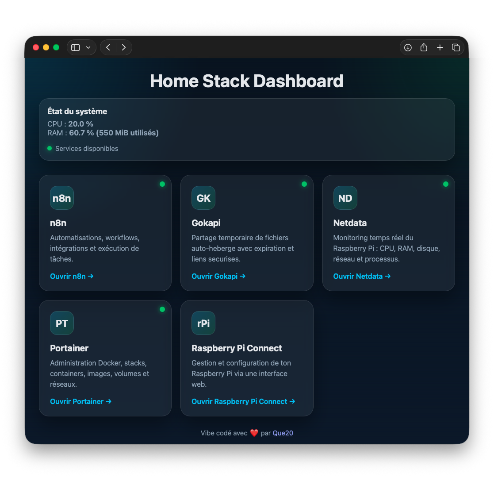
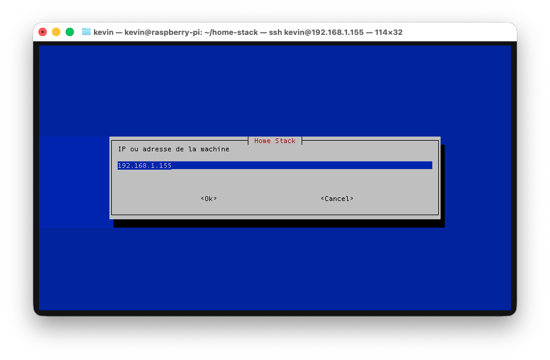
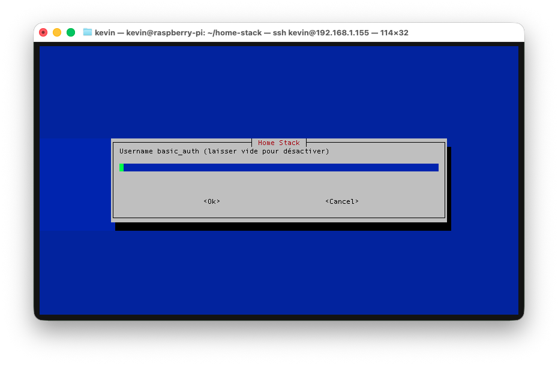
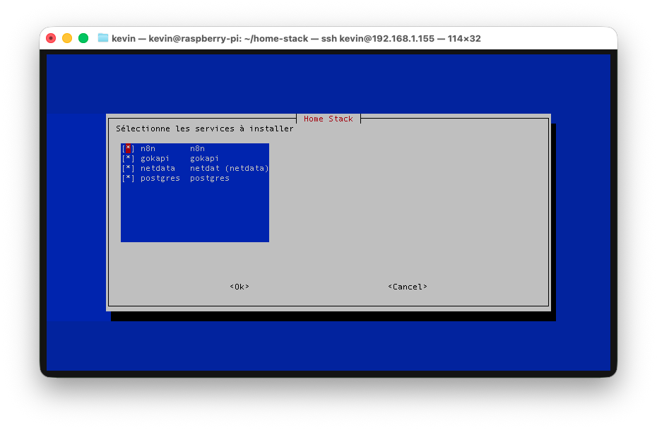

# Home Stack

Stack Docker pour monter rapidement un homelab sur Debian (Raspberry Pi, mini-PC, VM) avec un reverse proxy Caddy, un dashboard HTML simple et des services optionnels.

## Services disponibles

- `n8n`
- `gokapi`
- `netdata`
- `postgres`
- `caddy` (reverse proxy + page d'accueil)

## Captures d'ecran



<p align="center">
  
  
  
</p>


## Structure du projet

```text
home-stack/
|-- .env.example
|-- compose/
|   |-- gokapi/
|   |   `-- compose.yml
|   |-- n8n/
|   |   `-- compose.yml
|   |-- netdata/
|   |   `-- compose.yml
|   |-- postgres/
|   |   |-- compose.yml
|   |   `-- init.sql
|   `-- reverse-proxy/
|       |-- Caddyfile
|       `-- compose.yml
|-- html/
|   `-- index.html
|-- screenshot/
|   |-- basic_auth_input.png
|   |-- host_input.png
|   `-- services_select.png
`-- scripts/
    |-- backup.sh
    |-- init.sh
    |-- install.sh
    |-- install-docker.sh
    |-- restart.sh
    |-- restore.sh
    `-- stop.sh
```

## Prerequis

- OS Linux type Debian/Ubuntu
- `bash`
- `whiptail` (recommandé, fallback texte si absent)

Docker peut etre installe automatiquement par `scripts/init.sh` via `scripts/install-docker.sh`.

## Utilisation

1. Rendre les scripts executables:

```bash
chmod +x scripts/*.sh
```

2. Initialiser la configuration:

```bash
./scripts/init.sh
```

3. Installer et lancer les services choisis:

```bash
./scripts/install.sh
```

## Scripts utilitaires

- Redemarrer tous les conteneurs en cours:

```bash
./scripts/restart.sh
```

- Arrêter tous les conteneurs en cours:

```bash
./scripts/stop.sh
```

- Installer et configurer les paquet de sécurité: fail2ban, ufw et Unattended upgrades

```bash
./scripts/security.sh
```

## Backup et restore

- Sauvegarder les données `n8n`, `portainer` et `netdata`:

```bash
./scripts/backup.sh
```

Ce script crée des archives horodatées dans `backups/`:
- `backups/n8n_YYYYmmdd_HHMMSS.tar.gz`
- `backups/portainer_YYYYmmdd_HHMMSS.tar.gz`
- `backups/netdata_YYYYmmdd_HHMMSS.tar.gz`

- Réstaurer la derniere sauvegarde disponible de chaque service:

```bash
./scripts/restore.sh
```

- Restaurer une sauvegarde precise via timestamp:

```bash
./scripts/restore.sh 20260313_154500
```

Le script de restore stoppe temporairement les conteneurs concerns (`n8n`, `portainer`, `netdata`) puis les redémarre apres extraction.

## Variables `.env`

Valeurs gérées par `scripts/init.sh`:

- `HOST_IP`
- `BASIC_AUTH_USERNAME`
- `BASIC_AUTH_PASSWORD_HASH`

Valeurs applicatives (initialisées avec des defaults):

- `GENERIC_TIMEZONE`
- `POSTGRES_USER`
- `POSTGRES_PASSWORD`
- `POSTGRES_DB`

## Notes

- Les informations relatives à la config db sont à changer manuellement dans le .env.
- Le reseau Docker partage est `web`.
- Le fichier `compose/reverse-proxy/Caddyfile` est genéré automatiquement par `scripts/install.sh`.
- La page d'accueil est servie depuis `html/index.html`.
